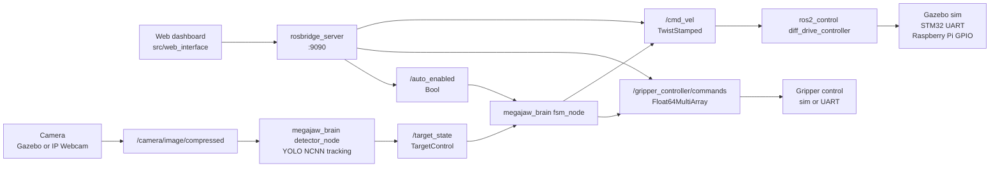

# MegaJaw

<!-- [](https://www.youtube.com/watch?v=nNZg3iLsRV4) -->

<!-- **Project walkthrough:** [Watch the MegaJaw explanation and demo on YouTube](https://www.youtube.com/watch?v=nNZg3iLsRV4) -->

MegaJaw is a ROS 2 autonomous mobile robot that detects, approaches, grips, and returns water bottles so it can keep searching for the next target. The project combines a differential-drive base, camera-based bottle detection, a custom gripper, Gazebo simulation, real hardware control, and a browser dashboard into one robotics workspace.

The goal is environmentally focused bottle recovery: MegaJaw patrols an area, identifies bottle-like targets, drives toward them, closes its gripper, backs away, drops the object, and repeats the cycle.

## Project Media

The README expects project media under `docs/assets/`. See `docs/assets/TODO.md` for the exact files to add.

| Hardware | Gazebo Simulation |
| --- | --- |
|  |  |

| Web Dashboard | Circuit / CAD |
| --- | --- |
|  |  |

## Highlights

- ROS 2 Jazzy workspace for simulation, visualization, autonomy, and hardware operation.
- Gazebo simulation with lightweight red-box bottle stand-ins to reduce simulation load.
- Real-world bottle detection using an Ultralytics YOLO NCNN model.
- Autonomous finite-state controller for target approach, gripper close, return motion, and release.
- ROS 2 control support for Gazebo, STM32-over-UART, and direct Raspberry Pi GPIO motor control.
- Browser-based control console using ROSBridge, joystick driving, gripper controls, live camera feed, target telemetry, and autonomous mode toggle.
- Custom robot description with differential drive, front camera, caster, and two-finger gripper.

## System Architecture



## Repository Layout

```text
.
|-- docs/
|   `-- assets/                 # README screenshots, diagrams, CAD/circuit previews
|-- src/
|   |-- megajaw_bringup/        # Launch files, controller configs, RViz config, Gazebo worlds
|   |-- megajaw_description/    # Xacro robot model and ros2_control backend definitions
|   |-- megajaw_brain/          # Detector and autonomous finite-state controller
|   |-- megajaw_hardware/       # STM32 UART ros2_control hardware interface, gripper, camera node
|   |-- megajaw_hardware_direct/# Direct Raspberry Pi GPIO ros2_control hardware interface
|   |-- megajaw_interfaces/     # Custom ROS 2 message definitions
|   |-- megajaw_uart_bridge/    # Standalone cmd_vel to STM32 UART bridge
|   |-- megajaw_dummy/          # Small development/test helper node
|   `-- web_interface/          # Browser control dashboard
`-- readme.md
```

## Hardware

MegaJaw's real hardware stack is built around:

- Raspberry Pi running Ubuntu and ROS 2 Jazzy.
- STM32 microcontroller for low-level motor/gripper control over UART.
- Two DC motors for differential-drive motion.
- H-bridge motor driver and buck converter/power stage.
- Mobile phone camera running IP Webcam.
- Custom gripper.
- Custom-fabricated MDF chassis and gripper structure.

The hardware launch currently targets the STM32 UART backend. The robot description also includes a direct Raspberry Pi GPIO backend for controlling the motors directly from the Pi.

## Software Stack

- Ubuntu with ROS 2 Jazzy.
- Gazebo simulation through ROS/Gazebo integration packages.
- `ros2_control`, `diff_drive_controller`, `joint_state_broadcaster`, and gripper position control.
- `robot_state_publisher`, RViz2, and Xacro robot description files.
- ROSBridge WebSocket server for browser control.
- OpenCV for camera capture and image processing.
- Ultralytics YOLO with NCNN-exported detection models.
- NumPy, PySerial, and pigpio for supporting perception and hardware control paths.

## Build

From the workspace root:

```bash
cd ~/megajaw_ws
rosdep install --from-paths src -y --ignore-src
colcon build --symlink-install
source install/setup.bash
```

If Gazebo cannot find local assets or Fuel models, export the Gazebo model path before launching simulation:

```bash
export GZ_SIM_RESOURCE_PATH="$HOME/.gz/sim/models:${GZ_SIM_RESOURCE_PATH}"
```

## Running MegaJaw

### Gazebo Simulation

Launch the simulated robot, Gazebo world, bridge, camera stream, detector, FSM, ROSBridge, and controllers:

```bash
ros2 launch megajaw_bringup gz.launch.py
```

The simulation world uses red box targets as bottle stand-ins. This keeps Gazebo lightweight while preserving the perception and control workflow used for bottle recovery.

### Real Hardware

Launch the real robot stack:

```bash
ros2 launch megajaw_bringup hardware.launch.py
```

The hardware launch starts the robot description, ROS 2 control, camera driver, bottle detector, autonomous FSM, ROSBridge, and gripper control node.

By default, `hardware.launch.py` uses the STM32 backend:

```text
backend_driver:=stm
```

The robot description also supports:

```text
backend_driver:=direct
```

Use `direct` when the Raspberry Pi should control the wheel GPIO pins directly through pigpio. Use `stm` when motor commands should be sent over UART to the STM32.

### RViz Visualization

Launch RViz with the robot description:

```bash
ros2 launch megajaw_bringup display.launch.py
```

This is useful for inspecting the URDF, transforms, joints, and robot model without starting the full simulation or hardware stack.

## Web Dashboard

Open the dashboard directly in a browser:

```text
src/web_interface/index.html
```

The dashboard connects through ROSBridge and supports three connection modes:

- `Auto`: tries Gazebo and real hardware endpoints and uses whichever is available first.
- `GZ`: forces the Gazebo endpoint at `ws://localhost:9090`.
- `Real`: forces the real robot endpoint at `ws://zeyadcodepi.local:9090`.

Dashboard features:

- Live compressed camera stream.
- Joystick manual drive control.
- Speed scaling.
- Gripper open/close buttons.
- Autonomous mode toggle through `/auto_enabled`.
- Target detection telemetry for `/target_state`.
- Connection and event logs.

Manual joystick and gripper controls are locked while autonomous mode is enabled.

## Autonomy Pipeline

MegaJaw's autonomy loop is implemented in `megajaw_brain`:

1. The camera publishes `/camera/image/compressed`.
2. `detector_node` runs YOLO NCNN detection and target tracking.
3. The detector publishes `megajaw_interfaces/msg/TargetControl` on `/target_state`.
4. `fsm_node` waits for `/auto_enabled`.
5. When autonomy is enabled and a target is detected, the FSM approaches the target using proportional linear and angular control.
6. When the estimated depth is below the close threshold, the gripper closes.
7. The robot reverses for the same duration it spent approaching.
8. The gripper opens and the robot returns to idle, ready for another bottle.

Current FSM states:

```text
IDLE -> TO_TARGET -> GRIPPER_CLOSE -> GO_HOME -> GRIPPER_OPEN -> IDLE
```

## Perception

MegaJaw uses different NCNN-exported YOLO models for simulation and real-world operation:

- Simulation model: detects Gazebo red boxes representing bottles.
- Real model: detects bottles from the mobile phone camera stream.

For depth estimation, MegaJaw uses the pinhole camera model:

```text
Z = (W * fx) / p
```

Where:

- `Z` is estimated depth.
- `W` is the real object width.
- `fx` is the focal length.
- `p` is the detected object width in pixels.

In simulation, `fx` is derived from the Gazebo camera image width and horizontal field of view. On real hardware, the detector uses calibrated camera intrinsics and distortion coefficients, undistorts the frame, rotates it into the expected orientation, and estimates depth from the detected bottle bounding box.

## ROS Topics

| Topic | Type | Purpose |
| --- | --- | --- |
| `/cmd_vel` | `geometry_msgs/msg/TwistStamped` | Differential-drive velocity command |
| `/gripper_controller/commands` | `std_msgs/msg/Float64MultiArray` | Gripper open/close command |
| `/auto_enabled` | `std_msgs/msg/Bool` | Enables or disables autonomous behavior |
| `/camera/image/compressed` | `sensor_msgs/msg/CompressedImage` | Camera stream for dashboard and detection |
| `/target_state` | `megajaw_interfaces/msg/TargetControl` | Detector output: horizontal error, depth, detection flag |
| `/clock` | `rosgraph_msgs/msg/Clock` | Gazebo simulation time bridge |

Custom target message:

```text
float32 err_x
float32 depth
bool target_detected
```

## Hardware Notes

### STM32 UART Backend

The STM32 motor backend sends packed UART commands using this protocol:

```text
[0xAA][0x55][left_pwm_low][left_pwm_high][right_pwm_low][right_pwm_high]
```

The default serial configuration is:

```text
serial_port: /dev/ttyAMA0
baudrate: 115200
```

The gripper command protocol uses:

```text
[0xAB][0xCD][command]
```

Where `0x00` opens the gripper and `0x01` closes it.

### Direct GPIO Backend

The direct backend uses pigpio to drive the wheel control pins directly from the Raspberry Pi. The current Xacro parameters are:

```text
left_wheel_pin_a: 5
left_wheel_pin_b: 6
right_wheel_pin_a: 26
right_wheel_pin_b: 19
```

Make sure `pigpiod` is running before using direct mode.

### Phone Camera

The real camera driver connects to IP Webcam video streams. Current configured URLs include:

```text
http://192.168.1.11:8080/video
http://192.168.43.1:8080/video
```

The camera node keeps the OpenCV buffer small to reduce latency and publishes JPEG-compressed frames on `/camera/image/compressed`.

## Development Notes

- Keep ROS packages under `src/`.
- Put portfolio/support assets at the repository root under `docs/`.
- Suggested future asset folders:
  - `docs/assets/` for README media.
  - `docs/cad/` for CAD files.
  - `docs/circuit_sim/` for Proteus and circuit simulation files.
- The current launch files are intentionally separated by workflow:
  - `gz.launch.py` for full Gazebo operation.
  - `hardware.launch.py` for the real robot.
  - `display.launch.py` for RViz-only visualization.
- The web interface can be opened directly and does not need a build step.

## Status

MegaJaw is a robotics prototype and portfolio project. The repository demonstrates the full loop from simulation to perception, manual control, autonomous behavior, and real hardware integration.
